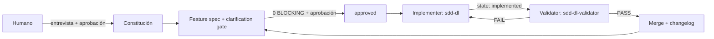

# SDD Agent DL para OpenCode

Agente de Spec-Driven Development (SDD) para [OpenCode](https://opencode.ai/), basado en el curso [Spec-Driven Development with Coding Agents](https://www.deeplearning.ai/courses/spec-driven-development-with-coding-agents) de DeepLearning.AI.

## What it is

Un flujo de desarrollo guiado por specs para coding agents: la idea de producto se convierte en una constitución, cada feature se especifica con requirements rastreables, se implementa con change control y se valida con un agente independiente antes de mergear.

No es un framework: son archivos Markdown, 3 scripts Node sin dependencias y la configuración de OpenCode. Se copia a un proyecto y funciona.

## Why

Los coding agents son buenos escribiendo código y malos recordando decisiones. SDD fuerza a persistir las decisiones en specs antes de codear, hace verificable qué se implementó de cada requirement (`trace.js`) y evita que el mismo agente valide su propio trabajo (validator independiente).

## Architecture



- **Orquestador** (`sdd-dl`): detecta el estado con `status.js`, propone la siguiente acción y coordina las fases.
- **Validator** (`sdd-dl-validator`): subagente independiente con `edit: deny`; evalúa acceptance criteria y checks reales, reporta PASS/FAIL/PARTIAL/NOT EXECUTED y no corrige código.
- **Estado explícito**: `state.md` por feature — `specifying → approved → implementing → implemented → validating → validated → merged` + flag `blocked`.
- **Trazabilidad**: IDs `REQ-001` / `TASK-001 (REQ-001)` / `VAL-001 (REQ-001)`; `trace.js` deriva la matriz y reporta gaps.
- **Scripts** (Node, sin dependencias): `status.js` (SDD STATUS determinista), `trace.js` (matriz + checks), `changelog.js` (CHANGELOG.md desde git).

## Workflow

1. `/sdd-dl-constitution` — mission, tech-stack y roadmap en `specs/constitution/`.
2. `/sdd-dl-feature-spec` — spec con REQs + clarification gate (BLOCKING/IMPORTANT/OPTIONAL) → aprobación humana.
3. `/sdd-dl-implement` — TASKs pequeños y reversibles; commits opcionales a solicitud del usuario; change control para specs aprobadas.
4. `/sdd-dl-validate` — validator independiente.
5. `/sdd-dl-merge` — changelog + merge (solo desde `validated`, 0 BLOCKING).

O `/sdd-dl` para el modo orquestado: detecta el estado y propone el siguiente paso.

## Quick Start

### 1. Inspeccionar y copiar el agente

La carpeta `.opencode/` y `AGENTS.md` deben quedar en la raíz. Antes de copiar, inspeccioná archivos existentes para no sobrescribir agentes, comandos o instrucciones locales.

```bash
# Desde la raíz de tu proyecto
cp -r /ruta/a/sdd-agent-dl/.opencode ./.opencode
cp /ruta/a/sdd-agent-dl/AGENTS.md ./AGENTS.md
```

En Windows (PowerShell):

```powershell
Copy-Item -Recurse /ruta/a/sdd-agent-dl/.opencode ./.opencode
Copy-Item /ruta/a/sdd-agent-dl/AGENTS.md ./AGENTS.md
```

### 2. Fusionar la configuración (opcional)

Si ya tenés `.opencode/opencode.json`, fusioná la entrada `agent.sdd-dl` del archivo del paquete con el tuyo antes de copiar. Si no existe, conserva el archivo en `.opencode/opencode.json`; no lo muevas a la raíz.

### 3. Inicializar OpenCode

Si es la primera vez, ejecutá `opencode` en tu proyecto y usá `/init` para que OpenCode reconozca los agentes y comandos. Luego corré `/sdd-dl`.

## Example

Una feature pequeña atravesando el flujo completo:

**Specify** — `/sdd-dl-feature-spec` crea `specs/2026-09-08-user-auth/` con `REQ-001` (login), `TASK-001 (REQ-001)` y `VAL-001 (REQ-001)`.
**Clarify** — el gate detecta una ambigüedad BLOCKING sobre recuperación de contraseña y pregunta; queda registrada en "Clarifications".
**Approve** — con 0 BLOCKING y la matriz de `trace.js` limpia, el usuario aprueba; `state.md` pasa a `approved`.
**Implement** — `/sdd-dl-implement` completa los TASKs, marca los checkboxes del plan y pasa a `implemented`.
**Validate** — `/sdd-dl-validate` ejecuta los checks de verdad con el validator independiente y marca los VALs con evidencia → `validated`.
**Merge** — `/sdd-dl-merge` actualiza `CHANGELOG.md`, mergea a la base y marca la fase del roadmap → `merged`.

## Safety

- Aprobaciones por riesgo: una solicitud explícita de implementación autoriza cambios locales en su alcance; specs aprobadas, dependencias adicionales, commits, ramas, merge y efectos externos conservan gates propios.
- Permisos OpenCode: el orquestador permite edición gobernada por estado y alcance; el validator tiene `edit: deny` y una allowlist de checks comunes para npm, pnpm y Yarn.
- Prohibiciones absolutas: no ocultar failures, no cambiar requirements para que parezcan cumplidos, no marcar PASS sin evidencia, no mergear con BLOCKING, no inventar resultados de tests.

## Portability

- **Específico de OpenCode**: agentes (`agents/*.md`), comandos (`commands/*.md`), permisos y `opencode.json`.
- **Agnóstico del harness**: specs (`specs/`), templates, `AGENTS.md`, la skill (`SKILL.md`) y los scripts (Node sin dependencias, usables fuera de OpenCode).
- **Modelos**: el agente no hardcodea modelo; usa el default de la config global. Cambiarlo con `/models` en el TUI o con `"model"` en `opencode.json`. El validator hereda el modelo del agente que lo invoca.

## Design decisions

- **Estado explícito**: `state.md` por feature evita que una sesión nueva infiera mal la fase; `status.js` lo valida de forma determinista.
- **IDs de requirements**: `REQ/TASK/VAL` permiten responder programáticamente qué está implementado, validado o sin cobertura.
- **Validator independiente**: reduce el sesgo de self-validation; reporta sin corregir.
- **Change control**: las specs aprobadas no se editan libremente; cambios materiales requieren aprobación humana e invalidan las validations afectadas.
- **Scripts deterministas**: lo que no necesita razonamiento (estado, matriz, changelog) no depende del LLM.
- **Trabajo sin commit**: el validator cubre commits, índice, working tree y archivos nuevos; el flujo no obliga a crear ramas o commits antes de la revisión humana.

## Versiones del paquete

- `sdd-dl`: 2.1.0
- `sdd-dl-validator`: 1.1.0
- `sdd-agent-dl-workflow`: 2.1.0

## Estructura

```text
sdd-agent-dl/
├── .opencode/
│   ├── agents/
│   │   ├── sdd-dl.md              # orquestador SDD
│   │   └── sdd-dl-validator.md    # validador independiente (subagent)
│   ├── commands/
│   │   ├── sdd-dl.md              # comando /sdd-dl
│   │   ├── sdd-dl-constitution.md # /sdd-dl-constitution
│   │   ├── sdd-dl-feature-spec.md # /sdd-dl-feature-spec
│   │   ├── sdd-dl-implement.md    # /sdd-dl-implement
│   │   ├── sdd-dl-validate.md     # /sdd-dl-validate
│   │   └── sdd-dl-merge.md        # /sdd-dl-merge
│   ├── skills/
│   │   └── sdd-agent-dl-workflow/
│   │       └── SKILL.md           # skill reutilizable
│   ├── templates/
│   │   ├── constitution/          # mission, tech-stack, roadmap
│   │   └── feature/               # requirements, plan, validation, state
│   ├── scripts/
│   │   ├── status.js              # SDD STATUS determinista
│   │   ├── trace.js               # matriz REQ → TASK → VAL
│   │   └── changelog.js           # helper para CHANGELOG.md
│   └── opencode.json              # definición del agente (mode + prompt)
├── evals/                         # fixtures + run-evals.js
├── AGENTS.md                      # instrucciones persistentes del proyecto
└── README.md                      # este archivo
```

## Créditos

Basado en los materiales del curso *Spec-Driven Development with Coding Agents* de DeepLearning.AI y JetBrains.
